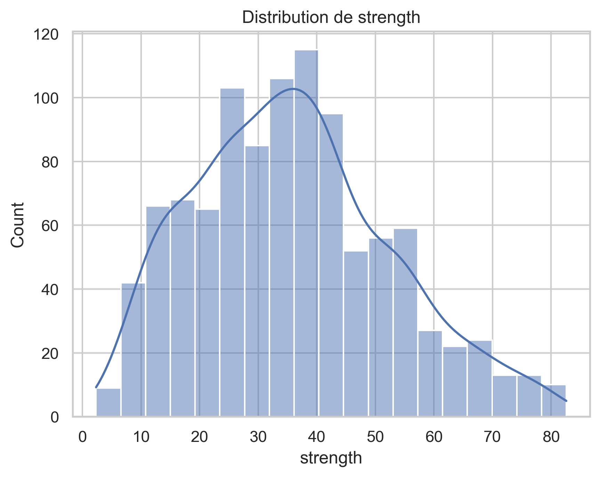
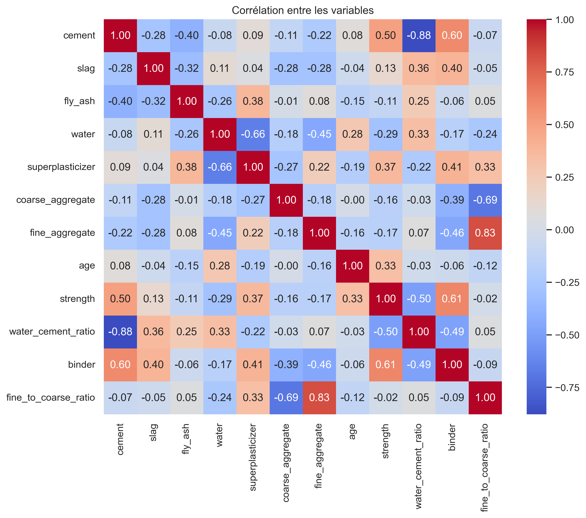
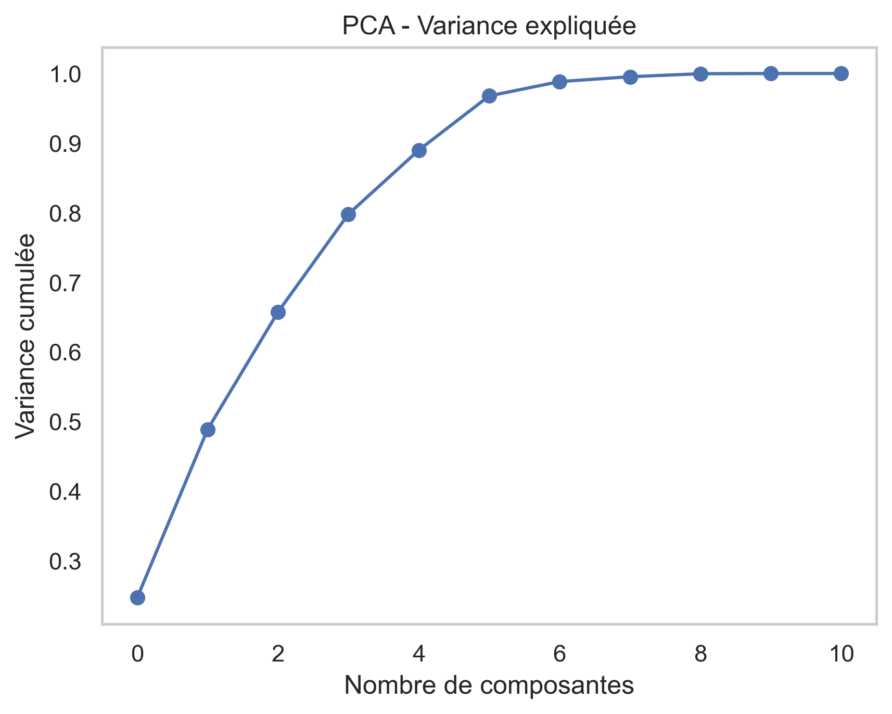
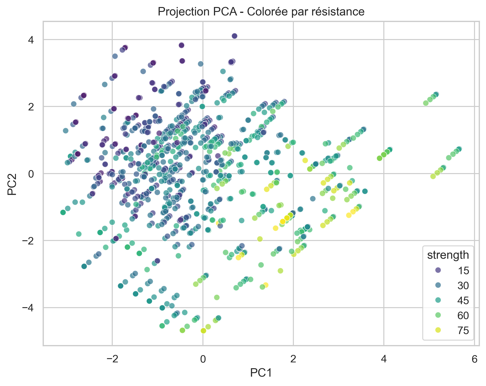
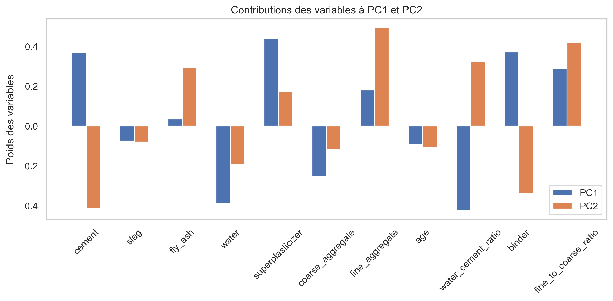

# 🧱 EDA - Analyse exploratoire du dataset Concrete Compressive Strength

Ce projet présente une **analyse exploratoire approfondie** du dataset *Concrete Compressive Strength* (résistance à la compression du béton), provenant de l’UCI Machine Learning Repository.

📊 L'objectif principal est de comprendre les relations entre les différentes variables de formulation du béton et leur impact sur sa résistance finale.

---

## 📁 Dataset

- **Source** : [UCI Machine Learning Repository](https://archive.ics.uci.edu/ml/machine-learning-databases/concrete/compressive/Concrete_Data.xls)
- **Format** : Excel
- **Taille** : 1030 échantillons, 9 variables initiales

---

## 📌 Variables d’entrée

| Variable                | Description                                        |
|------------------------|----------------------------------------------------|
| cement                 | Ciment (kg/m³)                                     |
| slag                   | Laitier de haut fourneau (kg/m³)                   |
| fly_ash                | Cendres volantes (kg/m³)                           |
| water                  | Eau (kg/m³)                                        |
| superplasticizer       | Superplastifiant (kg/m³)                           |
| coarse_aggregate       | Granulat grossier (kg/m³)                          |
| fine_aggregate         | Granulat fin (kg/m³)                               |
| age                    | Âge du béton (jours)                               |
| strength               | **Résistance à la compression** (MPa) *(cible)*    |

---

## 📦 Librairies utilisées

- `pandas`, `numpy`
- `matplotlib`, `seaborn`
- `scikit-learn` (StandardScaler, PCA, KMeans, f_regression)
- `scipy.stats` (z-score, pearsonr)

---

## 🧪 Étapes de l’analyse

### 1. Chargement et renommage
- Téléchargement des données
- Renommage des colonnes pour plus de clarté

### 2. Feature Engineering
Ajout de 3 variables pertinentes :
- `water_cement_ratio` (rapport eau / ciment)
- `binder` (ciment + laitier + cendres volantes)
- `fine_to_coarse_ratio` (rapport sable / gravier)

### 3. Statistiques descriptives
- Moyenne, médiane, min, max, quartiles
- Histogrammes + KDE pour toutes les variables
- Identification des valeurs extrêmes

### 4. Corrélations
- Matrice de corrélation avec heatmap
- Focus sur les 5 variables les plus corrélées à la **résistance** :
  - `binder` (+0.60)
  - `cement` (+0.50)
  - `water_cement_ratio` (−0.50)
  - `superplasticizer` (+0.37)
  - `age` (+0.33)

### 5. Analyse bivariée
- Scatter plots pour visualiser les relations entre :
  - `binder` et `strength`
  - `cement` et `strength`
  - `water_cement_ratio` et `strength`

### 6. Détection d’outliers
- Méthode du Z-score et IQR sur variables
- Identification des valeurs atypiques pour imputation

---

## 📷 Exemples de visualisations

---

## Analyse en Composantes Principales (PCA)

L'analyse en composantes principales (PCA) a été utilisée pour réduire la dimension du dataset tout en conservant l'essentiel de l'information.

- 📉 Les **4 premières composantes principales** expliquent environ **95 % de la variance cumulée**.
- 🪪 On observe un **"elbow"** clair entre la 4ᵉ et la 5ᵉ composante : les suivantes n'apportent que peu de gain en information.

- 📈 La **première composante (PC1)** est **modérément corrélée** à la résistance à la compression du béton :  
  **Corrélation PC1 - strength : 0.517 (p-value ≪ 0.001)**

Cela signifie que **PC1 permet d'avoir une part significative de la variable cible 'strength'**, et que **la majorité des ingrédients chimiques sont redondants**.

### 🔬 Variables les plus contributrices à PC1 :

| Rang | Variable               | Contribution (PC1) |
|------|------------------------|--------------------|
| 1    | superplasticizer       | +0.44              |
| 2    | binder                 | +0.37              |
| 3    | cement                 | +0.37              |
| 4    | fine_to_coarse_ratio  | +0.29              |
| 5    | water_cement_ratio     | –0.42              |
| 6    | water                  | –0.39              |
| 7    | coarse_aggregate       | –0.25              |

🧭 Une **projection 2D** via PCA montre un **gradient de résistance** le long de l’axe PC1, sans séparation nette → la résistance évolue **de façon continue** avec la composition du béton.

---

ℹ️ Cette analyse a guidé le choix du modèle de machine learning (XGBoost), capable de capturer les interactions complexes et non-linéaires révélées par la PCA.
